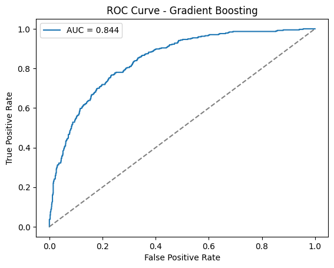
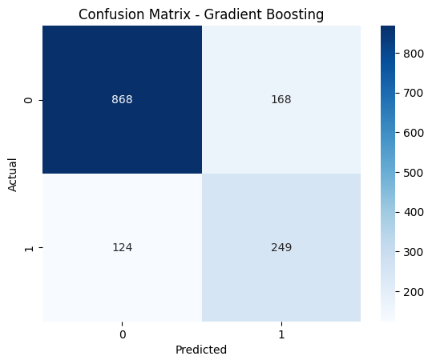
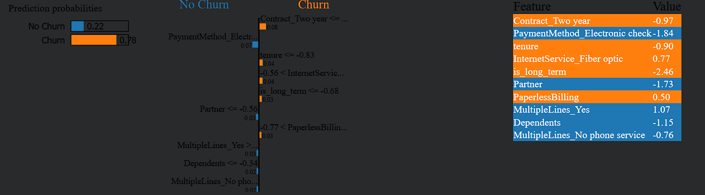
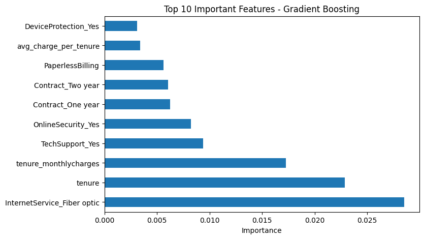

# 📊 Telecom Customer Churn Prediction

## 🚀 Overview

Customer churn directly impacts revenue in the telecom industry, where retaining customers is significantly cheaper than acquiring new ones. This project builds a machine learning model to identify high-risk customers and enable proactive retention strategies.

---

## 🧠 Problem

Telecom companies face high churn rates due to pricing, service quality, and competition. The challenge is to identify customers likely to churn before they leave, allowing targeted interventions.

---

## ⚙️ Solution

* Built a Gradient Boosting model using Scikit-learn
* Performed feature engineering and preprocessing
* Handled class imbalance using SMOTE
* Tuned model using GridSearchCV

---

## 📈 Results

* ROC-AUC: 0.844
* Accuracy: 79%

### 🔍 Key Drivers of Churn (via SHAP)

* Contract type
* Fibre optic internet
* Monthly charges

---

## 📊 Model Performance

---

🔍 Business Insights
Customers on month-to-month contracts are most likely to churn
Higher monthly charges significantly increase churn risk
Fibre optic users show higher churn probability

👉 These insights can be used to design targeted retention strategies such as pricing optimization and contract incentives.

---

## 🔄 ML Pipeline

1. Data preprocessing and cleaning
2. Feature engineering
3. Handling class imbalance (SMOTE)
4. Model selection and tuning
5. Model evaluation
6. Model interpretability using SHAP

---

## 🚀 Production Considerations

If deployed in a real-world system:

* Serve model using FastAPI
* Automate pipelines using Airflow
* Monitor model performance and drift
* Store data/models using AWS S3
* Visualize insights using Power BI dashboards

---

## 🛠 Tech Stack

Python, Pandas, NumPy, Scikit-learn, SHAP, SMOTE, Matplotlib

---

## ▶️ How to Run

1. Clone the repository
2. Install dependencies
   pip install -r requirements.txt
3. Run the notebook in the notebooks/ folder

---

## 📂 Project Structure

* data/ → dataset
* notebooks/ → analysis and modeling
* images/ → visualizations

---

## 📬 Contact

LinkedIn: https://linkedin.com/in/madhav-grover-a126b1226
Email: [grovermadhav@gmail.com](mailto:grovermadhav@gmail.com)
