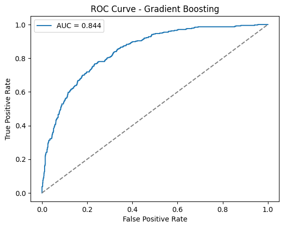
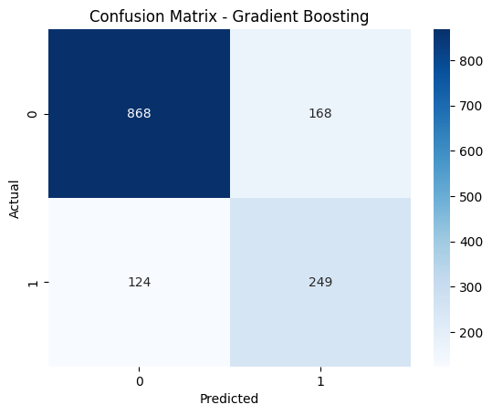
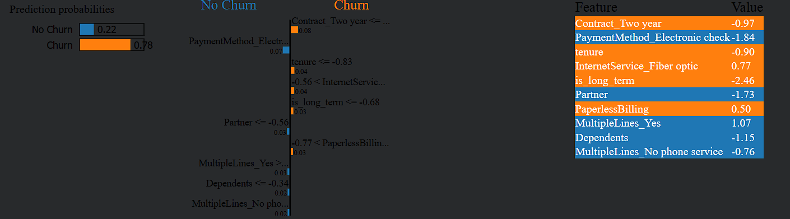
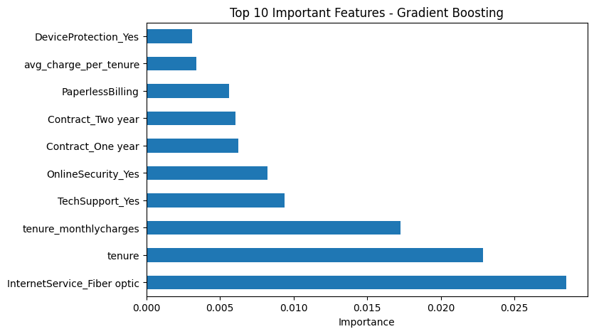

# 📊 Telecom Customer Churn Prediction

End-to-end customer churn analysis and predictive modelling using Python and Scikit-learn, achieving **0.844 ROC-AUC** on 7,043 telecom customer records.

---

## 🎯 Problem

Telecom companies need to identify customers who are at higher risk of churn so they can better understand churn drivers and support targeted retention strategies.

The goal of this project was to analyse customer behaviour, identify key churn drivers, and build a machine learning model capable of distinguishing customers who are likely to churn.

---

## 🔍 Approach

The project followed an end-to-end data science workflow:

1. **Data Cleaning & Exploration**
   - Analysed 7,043 customer records
   - Investigated distributions, relationships and churn patterns
   - Identified relevant customer and service features

2. **Feature Engineering & Preprocessing**
   - Prepared numerical and categorical features
   - Applied appropriate preprocessing techniques
   - Addressed class imbalance using **SMOTE**

3. **Model Development**
   - Compared multiple classification approaches
   - Developed a Gradient Boosting classifier using Scikit-learn
   - Optimised model hyperparameters using **GridSearchCV**

4. **Model Evaluation**
   - Evaluated performance using ROC-AUC, accuracy and confusion matrix
   - Final model achieved **0.844 ROC-AUC** and **79% test accuracy**

5. **Model Interpretability**
   - Used **SHAP** to understand the features contributing to model predictions
   - Translated model outputs into business-relevant insights

---

## 📈 Results

| Metric | Result |
|---|---:|
| ROC-AUC | **0.844** |
| Test Accuracy | **79%** |
| Dataset Size | **7,043 records** |

### 🔍 Key Churn Drivers

SHAP analysis identified several important factors associated with churn:

- **Contract type**
- **Fibre optic internet service**
- **Monthly charges**

These findings help highlight customer characteristics associated with higher churn risk and can inform further investigation into retention strategies.

---

## 📊 Model Performance

### ROC Curve



### Confusion Matrix



### SHAP Feature Importance



### Top Feature Importance



---

## 🔄 ML Pipeline

```text
Raw Customer Data
       ↓
Data Cleaning & EDA
       ↓
Feature Engineering
       ↓
Preprocessing
       ↓
SMOTE
       ↓
Model Comparison
       ↓
Gradient Boosting
       ↓
Hyperparameter Tuning
       ↓
Model Evaluation
       ↓
SHAP Interpretability
       ↓
Business Insights
